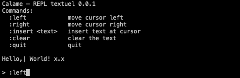

# Calame

Calame is a small thought-experiment machine to play and experiment reflexive and interactive systems.

```markdown

```

It provides a small set of concepts to describe:
- a *space*,
- how it is *observed*,
- how it is *internally transformed*,

without prescribing any execution model, user interface or runtime.

Calame is intentionally small and stable and future works
are expected to live in separate projects, or on top of it.

## Core principle

At its core, Calame revolves a single structure: machine.ml

  +------------------+
  |     Machine      |
  |------------------|
  | space : x        |
  | obs   : x -> a   |
  | stab  : x -> x   |
  +------------------+

## Example: small textual REPL

A small `calame` executable is shipped with the repository.

It implements a REPL over a Unicode text and a cursor using Calame's core abstractions.

Example session : 

## Running the example

With opam and dune installed:

```sh
dune build
dune exec calame
```

## Language-agnostic core

Although implemented in OCaml, Calame is *language-agnostic by design*.

The Ocaml codebase is a reference implementation of the model,
not a mandatory dependency.

The same concepts can be reimplemented in other languages
(e.g. C++, Rust) to build independent programs that share the same
underlying model, that is a machine can be represented as observations
of a space in movement (a dynamic space).
